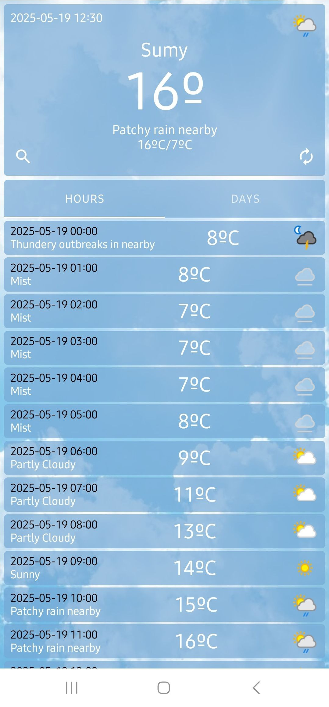
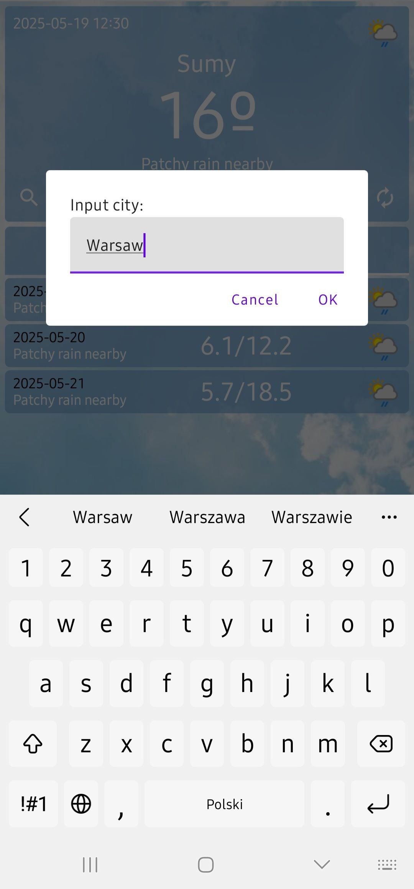

# ☀️ Weathery

<p align="center">
  
</p>

**Weathery** is a modern, elegant weather app built with **Jetpack Compose**.  
Get precise forecasts with a clean UI and smooth performance.

---

## 📱 Screenshots

<p float="left">
  
  
  
</p>

---

## ✨ Features

- 🌦 Real-time weather updates
- 📍 Auto location detection
- 🎨 Jetpack Compose UI
- 🌙 Dark/Light Mode
- 🔄 Swipe to refresh
- 🔍 Search by city *(coming soon)*

---

## 🧱 Built With

| Tech                     | Description                                      |
|--------------------------|--------------------------------------------------|
| 🧠 **Kotlin**            | Modern programming language for Android          |
| 🧩 **Jetpack Compose**   | Declarative UI toolkit for native Android        |
| 🏗 **MVVM Architecture** | Clean and maintainable project structure         |
| 🌐 **Retrofit**          | HTTP client for API calls                        |
| ⏱ **Kotlin Coroutines** | Asynchronous programming                         |
| 💉 **Hilt**              | Dependency injection for easier management       |
| 📍 **FusedLocationProvider** | Precise location services                   |

---

## 🚀 Getting Started

### 1. Clone the repo

```bash
git clone https://github.com/cobralicious/Weathery.git
cd Weathery
```

### 2. Open in Android Studio
- Open Android Studio

- Click Open and navigate to the project folder

- Let Gradle sync and build the project

### 3. Run the app
- Select an emulator or connected device

- Press `Run ▶️`

---

## 📥 Download APK

You can download the latest **Weathery** APK directly by clicking the link below:

[**Download Weathery-debug.apk**](https://github.com/username/repo/raw/main/Weathery/apk/debug/Weathery-debug.apk)

*(Make sure to allow installation from unknown sources on your device)*

---
  
### 🧑‍💻 Author
Created with ❤️ by [**@cobralicious**](https://t.me/cobralicious) 

